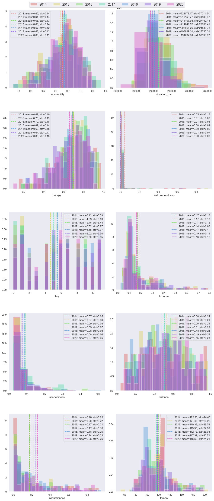

```python
import spotipy
import matplotlib.pyplot as plt
import seaborn as sns
from helpers import get_playlist_audio_features
from spotipy.oauth2 import SpotifyClientCredentials, SpotifyOauthError
from secrets import *
import pandas as pd
from pprint import pprint
import numpy as np
```


```python
corpus_playlist = {'2020': '6s2oVTnYPWiOQ3NWeQXQi0',
                   '2019': '4GE2vQbmdOXyNO0emar1Na',
                   '2018': '7gwthBoLwD3pmNAddLghAf',
                   '2017': '0UmGzufa2clHxFb1gyP5Vb',
                   '2016': '2fi7vnsg3MlzRVMLzKmJLM',
                   '2015': '1Vxi2dBccOTLRW7BPPg6EO',
                   '2014': '7AWknWlwF23A9VJnHeYuAr'}
```


```python
# Connect to spotipy and store session in sp

client_credentials_manager = SpotifyClientCredentials(client_id = SPOTIFY_CLIENT_ID,client_secret = SPOTIFY_CLIENT_SECRET)
sp = spotipy.Spotify(client_credentials_manager=client_credentials_manager)
```


```python
# Gather all audio features

df_playlists_w_audio_features = {}
playlists_w_audio_features = dict([(i, get_playlist_audio_features(j, sp)) for i,j in corpus_playlist.items()])

for year, audio_features in playlists_w_audio_features.items():
    df_playlists_w_audio_features[year] = pd.DataFrame.from_dict(audio_features, orient='index')

print(df_playlists_w_audio_features.keys())
```

    dict_keys(['2020', '2019', '2018', '2017', '2016', '2015', '2014'])


# Overview table for each year

### 2020


```python
df_playlists_w_audio_features['2020'].describe()
```


<div>
<style scoped>
    .dataframe tbody tr th:only-of-type {
        vertical-align: middle;
    }

    .dataframe tbody tr th {
        vertical-align: top;
    }

    .dataframe thead th {
        text-align: right;
    }
</style>
<table border="1" class="dataframe">
  <thead>
    <tr style="text-align: right;">
      <th></th>
      <th>danceability</th>
      <th>energy</th>
      <th>key</th>
      <th>loudness</th>
      <th>mode</th>
      <th>speechiness</th>
      <th>acousticness</th>
      <th>instrumentalness</th>
      <th>liveness</th>
      <th>valence</th>
      <th>tempo</th>
      <th>duration_ms</th>
      <th>time_signature</th>
    </tr>
  </thead>
  <tbody>
    <tr>
      <th>count</th>
      <td>100.000000</td>
      <td>100.000000</td>
      <td>100.000000</td>
      <td>100.000000</td>
      <td>100.000000</td>
      <td>100.000000</td>
      <td>100.000000</td>
      <td>100.000000</td>
      <td>100.000000</td>
      <td>100.000000</td>
      <td>100.000000</td>
      <td>100.000000</td>
      <td>100.000000</td>
    </tr>
    <tr>
      <th>mean</th>
      <td>0.676720</td>
      <td>0.658135</td>
      <td>5.500000</td>
      <td>-6.158160</td>
      <td>0.590000</td>
      <td>0.071280</td>
      <td>0.261932</td>
      <td>0.000497</td>
      <td>0.163740</td>
      <td>0.546172</td>
      <td>116.588950</td>
      <td>191232.000000</td>
      <td>3.980000</td>
    </tr>
    <tr>
      <th>std</th>
      <td>0.114554</td>
      <td>0.162752</td>
      <td>3.546231</td>
      <td>2.237104</td>
      <td>0.494311</td>
      <td>0.053031</td>
      <td>0.263110</td>
      <td>0.002313</td>
      <td>0.116849</td>
      <td>0.226241</td>
      <td>24.211059</td>
      <td>30130.069253</td>
      <td>0.140705</td>
    </tr>
    <tr>
      <th>min</th>
      <td>0.333000</td>
      <td>0.094500</td>
      <td>0.000000</td>
      <td>-18.377000</td>
      <td>0.000000</td>
      <td>0.025300</td>
      <td>0.001150</td>
      <td>0.000000</td>
      <td>0.048900</td>
      <td>0.067800</td>
      <td>75.002000</td>
      <td>107200.000000</td>
      <td>3.000000</td>
    </tr>
    <tr>
      <th>25%</th>
      <td>0.596500</td>
      <td>0.562250</td>
      <td>2.000000</td>
      <td>-7.081250</td>
      <td>0.000000</td>
      <td>0.039475</td>
      <td>0.033150</td>
      <td>0.000000</td>
      <td>0.090550</td>
      <td>0.370750</td>
      <td>98.792750</td>
      <td>172601.000000</td>
      <td>4.000000</td>
    </tr>
    <tr>
      <th>50%</th>
      <td>0.675000</td>
      <td>0.695500</td>
      <td>6.000000</td>
      <td>-5.770000</td>
      <td>1.000000</td>
      <td>0.052700</td>
      <td>0.176500</td>
      <td>0.000000</td>
      <td>0.113000</td>
      <td>0.534500</td>
      <td>118.040000</td>
      <td>185947.500000</td>
      <td>4.000000</td>
    </tr>
    <tr>
      <th>75%</th>
      <td>0.764750</td>
      <td>0.774750</td>
      <td>8.000000</td>
      <td>-4.723500</td>
      <td>1.000000</td>
      <td>0.087500</td>
      <td>0.418000</td>
      <td>0.000009</td>
      <td>0.189000</td>
      <td>0.744500</td>
      <td>124.058500</td>
      <td>208292.750000</td>
      <td>4.000000</td>
    </tr>
    <tr>
      <th>max</th>
      <td>0.894000</td>
      <td>0.936000</td>
      <td>11.000000</td>
      <td>-3.158000</td>
      <td>1.000000</td>
      <td>0.360000</td>
      <td>0.879000</td>
      <td>0.019200</td>
      <td>0.696000</td>
      <td>0.962000</td>
      <td>199.971000</td>
      <td>342613.000000</td>
      <td>4.000000</td>
    </tr>
  </tbody>
</table>
</div>


## 2019


```python
df_playlists_w_audio_features['2019'].describe()
```


<div>
<style scoped>
    .dataframe tbody tr th:only-of-type {
        vertical-align: middle;
    }

    .dataframe tbody tr th {
        vertical-align: top;
    }

    .dataframe thead th {
        text-align: right;
    }
</style>
<table border="1" class="dataframe">
  <thead>
    <tr style="text-align: right;">
      <th></th>
      <th>danceability</th>
      <th>energy</th>
      <th>key</th>
      <th>loudness</th>
      <th>mode</th>
      <th>speechiness</th>
      <th>acousticness</th>
      <th>instrumentalness</th>
      <th>liveness</th>
      <th>valence</th>
      <th>tempo</th>
      <th>duration_ms</th>
      <th>time_signature</th>
    </tr>
  </thead>
  <tbody>
    <tr>
      <th>count</th>
      <td>100.000000</td>
      <td>100.000000</td>
      <td>100.000000</td>
      <td>100.000000</td>
      <td>100.000000</td>
      <td>100.000000</td>
      <td>100.000000</td>
      <td>100.000000</td>
      <td>100.000000</td>
      <td>100.000000</td>
      <td>100.000000</td>
      <td>100.000000</td>
      <td>100.000000</td>
    </tr>
    <tr>
      <th>mean</th>
      <td>0.657760</td>
      <td>0.642080</td>
      <td>6.020000</td>
      <td>-5.889950</td>
      <td>0.560000</td>
      <td>0.076711</td>
      <td>0.237333</td>
      <td>0.008981</td>
      <td>0.185687</td>
      <td>0.492500</td>
      <td>117.385360</td>
      <td>196699.310000</td>
      <td>3.990000</td>
    </tr>
    <tr>
      <th>std</th>
      <td>0.121518</td>
      <td>0.167244</td>
      <td>3.501746</td>
      <td>2.302609</td>
      <td>0.498888</td>
      <td>0.062096</td>
      <td>0.234672</td>
      <td>0.067045</td>
      <td>0.139178</td>
      <td>0.215027</td>
      <td>25.708106</td>
      <td>27723.313439</td>
      <td>0.224508</td>
    </tr>
    <tr>
      <th>min</th>
      <td>0.383000</td>
      <td>0.225000</td>
      <td>0.000000</td>
      <td>-14.454000</td>
      <td>0.000000</td>
      <td>0.025900</td>
      <td>0.009870</td>
      <td>0.000000</td>
      <td>0.045000</td>
      <td>0.079700</td>
      <td>71.884000</td>
      <td>147840.000000</td>
      <td>3.000000</td>
    </tr>
    <tr>
      <th>25%</th>
      <td>0.576500</td>
      <td>0.524500</td>
      <td>4.000000</td>
      <td>-6.911500</td>
      <td>0.000000</td>
      <td>0.039475</td>
      <td>0.052125</td>
      <td>0.000000</td>
      <td>0.097075</td>
      <td>0.327000</td>
      <td>98.009250</td>
      <td>177598.000000</td>
      <td>4.000000</td>
    </tr>
    <tr>
      <th>50%</th>
      <td>0.672500</td>
      <td>0.650500</td>
      <td>6.000000</td>
      <td>-5.664500</td>
      <td>1.000000</td>
      <td>0.056600</td>
      <td>0.144000</td>
      <td>0.000000</td>
      <td>0.120000</td>
      <td>0.492000</td>
      <td>113.922000</td>
      <td>193657.500000</td>
      <td>4.000000</td>
    </tr>
    <tr>
      <th>75%</th>
      <td>0.744000</td>
      <td>0.763500</td>
      <td>9.000000</td>
      <td>-4.440000</td>
      <td>1.000000</td>
      <td>0.087250</td>
      <td>0.340500</td>
      <td>0.000003</td>
      <td>0.224250</td>
      <td>0.628750</td>
      <td>130.042500</td>
      <td>210978.000000</td>
      <td>4.000000</td>
    </tr>
    <tr>
      <th>max</th>
      <td>0.926000</td>
      <td>0.906000</td>
      <td>11.000000</td>
      <td>-2.097000</td>
      <td>1.000000</td>
      <td>0.375000</td>
      <td>0.902000</td>
      <td>0.657000</td>
      <td>0.764000</td>
      <td>0.952000</td>
      <td>197.705000</td>
      <td>277262.000000</td>
      <td>5.000000</td>
    </tr>
  </tbody>
</table>
</div>


## 2018


```python
df_playlists_w_audio_features['2018'].describe()
```


<div>
<style scoped>
    .dataframe tbody tr th:only-of-type {
        vertical-align: middle;
    }

    .dataframe tbody tr th {
        vertical-align: top;
    }

    .dataframe thead th {
        text-align: right;
    }
</style>
<table border="1" class="dataframe">
  <thead>
    <tr style="text-align: right;">
      <th></th>
      <th>danceability</th>
      <th>energy</th>
      <th>key</th>
      <th>loudness</th>
      <th>mode</th>
      <th>speechiness</th>
      <th>acousticness</th>
      <th>instrumentalness</th>
      <th>liveness</th>
      <th>valence</th>
      <th>tempo</th>
      <th>duration_ms</th>
      <th>time_signature</th>
    </tr>
  </thead>
  <tbody>
    <tr>
      <th>count</th>
      <td>98.000000</td>
      <td>98.000000</td>
      <td>98.000000</td>
      <td>98.000000</td>
      <td>98.000000</td>
      <td>98.000000</td>
      <td>98.000000</td>
      <td>98.000000</td>
      <td>98.000000</td>
      <td>98.000000</td>
      <td>98.000000</td>
      <td>98.000000</td>
      <td>98.000000</td>
    </tr>
    <tr>
      <th>mean</th>
      <td>0.671735</td>
      <td>0.689959</td>
      <td>5.551020</td>
      <td>-5.556133</td>
      <td>0.632653</td>
      <td>0.084986</td>
      <td>0.182816</td>
      <td>0.000709</td>
      <td>0.168858</td>
      <td>0.480874</td>
      <td>112.753245</td>
      <td>202868.255102</td>
      <td>3.989796</td>
    </tr>
    <tr>
      <th>std</th>
      <td>0.116117</td>
      <td>0.153140</td>
      <td>3.669665</td>
      <td>1.742651</td>
      <td>0.484561</td>
      <td>0.080741</td>
      <td>0.196541</td>
      <td>0.003213</td>
      <td>0.109513</td>
      <td>0.214087</td>
      <td>23.075875</td>
      <td>24843.783828</td>
      <td>0.175564</td>
    </tr>
    <tr>
      <th>min</th>
      <td>0.258000</td>
      <td>0.215000</td>
      <td>0.000000</td>
      <td>-14.221000</td>
      <td>0.000000</td>
      <td>0.023200</td>
      <td>0.000862</td>
      <td>0.000000</td>
      <td>0.021500</td>
      <td>0.096700</td>
      <td>68.976000</td>
      <td>153391.000000</td>
      <td>3.000000</td>
    </tr>
    <tr>
      <th>25%</th>
      <td>0.599250</td>
      <td>0.613000</td>
      <td>2.000000</td>
      <td>-6.437000</td>
      <td>0.000000</td>
      <td>0.041475</td>
      <td>0.040625</td>
      <td>0.000000</td>
      <td>0.098200</td>
      <td>0.321500</td>
      <td>95.980000</td>
      <td>185944.000000</td>
      <td>4.000000</td>
    </tr>
    <tr>
      <th>50%</th>
      <td>0.682500</td>
      <td>0.711500</td>
      <td>6.000000</td>
      <td>-5.374000</td>
      <td>1.000000</td>
      <td>0.058950</td>
      <td>0.125500</td>
      <td>0.000000</td>
      <td>0.121500</td>
      <td>0.480500</td>
      <td>105.065500</td>
      <td>201443.500000</td>
      <td>4.000000</td>
    </tr>
    <tr>
      <th>75%</th>
      <td>0.752000</td>
      <td>0.800000</td>
      <td>9.000000</td>
      <td>-4.563000</td>
      <td>1.000000</td>
      <td>0.093975</td>
      <td>0.284500</td>
      <td>0.000010</td>
      <td>0.210000</td>
      <td>0.646750</td>
      <td>125.721750</td>
      <td>216255.000000</td>
      <td>4.000000</td>
    </tr>
    <tr>
      <th>max</th>
      <td>0.897000</td>
      <td>0.937000</td>
      <td>11.000000</td>
      <td>-2.384000</td>
      <td>1.000000</td>
      <td>0.516000</td>
      <td>0.948000</td>
      <td>0.019200</td>
      <td>0.552000</td>
      <td>0.926000</td>
      <td>180.073000</td>
      <td>278893.000000</td>
      <td>5.000000</td>
    </tr>
  </tbody>
</table>
</div>


## 2017


```python
df_playlists_w_audio_features['2017'].describe()
```


<div>
<style scoped>
    .dataframe tbody tr th:only-of-type {
        vertical-align: middle;
    }

    .dataframe tbody tr th {
        vertical-align: top;
    }

    .dataframe thead th {
        text-align: right;
    }
</style>
<table border="1" class="dataframe">
  <thead>
    <tr style="text-align: right;">
      <th></th>
      <th>danceability</th>
      <th>energy</th>
      <th>key</th>
      <th>loudness</th>
      <th>mode</th>
      <th>speechiness</th>
      <th>acousticness</th>
      <th>instrumentalness</th>
      <th>liveness</th>
      <th>valence</th>
      <th>tempo</th>
      <th>duration_ms</th>
      <th>time_signature</th>
    </tr>
  </thead>
  <tbody>
    <tr>
      <th>count</th>
      <td>100.000000</td>
      <td>100.000000</td>
      <td>100.00000</td>
      <td>100.000000</td>
      <td>100.000000</td>
      <td>100.000000</td>
      <td>100.000000</td>
      <td>100.000000</td>
      <td>100.000000</td>
      <td>100.000000</td>
      <td>100.000000</td>
      <td>100.000000</td>
      <td>100.00</td>
    </tr>
    <tr>
      <th>mean</th>
      <td>0.677240</td>
      <td>0.685870</td>
      <td>5.02000</td>
      <td>-5.402380</td>
      <td>0.540000</td>
      <td>0.093583</td>
      <td>0.170475</td>
      <td>0.003861</td>
      <td>0.142019</td>
      <td>0.510440</td>
      <td>115.949530</td>
      <td>214241.520000</td>
      <td>3.99</td>
    </tr>
    <tr>
      <th>std</th>
      <td>0.135948</td>
      <td>0.144091</td>
      <td>3.77386</td>
      <td>1.616101</td>
      <td>0.500908</td>
      <td>0.073109</td>
      <td>0.179071</td>
      <td>0.023415</td>
      <td>0.075952</td>
      <td>0.220258</td>
      <td>24.903377</td>
      <td>29833.408491</td>
      <td>0.10</td>
    </tr>
    <tr>
      <th>min</th>
      <td>0.258000</td>
      <td>0.174000</td>
      <td>0.00000</td>
      <td>-11.377000</td>
      <td>0.000000</td>
      <td>0.023200</td>
      <td>0.001680</td>
      <td>0.000000</td>
      <td>0.040400</td>
      <td>0.086200</td>
      <td>75.016000</td>
      <td>152480.000000</td>
      <td>3.00</td>
    </tr>
    <tr>
      <th>25%</th>
      <td>0.608750</td>
      <td>0.597000</td>
      <td>1.00000</td>
      <td>-6.491750</td>
      <td>0.000000</td>
      <td>0.043875</td>
      <td>0.043500</td>
      <td>0.000000</td>
      <td>0.092675</td>
      <td>0.339000</td>
      <td>100.000500</td>
      <td>195120.500000</td>
      <td>4.00</td>
    </tr>
    <tr>
      <th>50%</th>
      <td>0.680500</td>
      <td>0.708000</td>
      <td>5.00000</td>
      <td>-5.243500</td>
      <td>1.000000</td>
      <td>0.067600</td>
      <td>0.113000</td>
      <td>0.000000</td>
      <td>0.113500</td>
      <td>0.513000</td>
      <td>109.006500</td>
      <td>211471.000000</td>
      <td>4.00</td>
    </tr>
    <tr>
      <th>75%</th>
      <td>0.768250</td>
      <td>0.797750</td>
      <td>8.00000</td>
      <td>-4.272750</td>
      <td>1.000000</td>
      <td>0.110500</td>
      <td>0.211500</td>
      <td>0.000010</td>
      <td>0.164000</td>
      <td>0.678000</td>
      <td>123.986750</td>
      <td>230283.500000</td>
      <td>4.00</td>
    </tr>
    <tr>
      <th>max</th>
      <td>0.965000</td>
      <td>0.913000</td>
      <td>11.00000</td>
      <td>-1.401000</td>
      <td>1.000000</td>
      <td>0.310000</td>
      <td>0.851000</td>
      <td>0.210000</td>
      <td>0.394000</td>
      <td>0.966000</td>
      <td>194.169000</td>
      <td>340707.000000</td>
      <td>4.00</td>
    </tr>
  </tbody>
</table>
</div>


## 2016


```python
df_playlists_w_audio_features['2016'].describe()
```


<div>
<style scoped>
    .dataframe tbody tr th:only-of-type {
        vertical-align: middle;
    }

    .dataframe tbody tr th {
        vertical-align: top;
    }

    .dataframe thead th {
        text-align: right;
    }
</style>
<table border="1" class="dataframe">
  <thead>
    <tr style="text-align: right;">
      <th></th>
      <th>danceability</th>
      <th>energy</th>
      <th>key</th>
      <th>loudness</th>
      <th>mode</th>
      <th>speechiness</th>
      <th>acousticness</th>
      <th>instrumentalness</th>
      <th>liveness</th>
      <th>valence</th>
      <th>tempo</th>
      <th>duration_ms</th>
      <th>time_signature</th>
    </tr>
  </thead>
  <tbody>
    <tr>
      <th>count</th>
      <td>99.000000</td>
      <td>99.000000</td>
      <td>99.000000</td>
      <td>99.000000</td>
      <td>99.000000</td>
      <td>99.000000</td>
      <td>99.000000</td>
      <td>99.000000</td>
      <td>99.000000</td>
      <td>99.000000</td>
      <td>99.000000</td>
      <td>99.000000</td>
      <td>99.000000</td>
    </tr>
    <tr>
      <th>mean</th>
      <td>0.660414</td>
      <td>0.699869</td>
      <td>5.464646</td>
      <td>-5.791283</td>
      <td>0.505051</td>
      <td>0.093480</td>
      <td>0.174086</td>
      <td>0.005834</td>
      <td>0.174965</td>
      <td>0.501849</td>
      <td>119.375939</td>
      <td>214107.979798</td>
      <td>3.979798</td>
    </tr>
    <tr>
      <th>std</th>
      <td>0.125772</td>
      <td>0.152590</td>
      <td>3.435449</td>
      <td>1.800518</td>
      <td>0.502519</td>
      <td>0.084577</td>
      <td>0.208601</td>
      <td>0.036536</td>
      <td>0.119779</td>
      <td>0.210546</td>
      <td>27.527436</td>
      <td>27150.128294</td>
      <td>0.141407</td>
    </tr>
    <tr>
      <th>min</th>
      <td>0.358000</td>
      <td>0.174000</td>
      <td>0.000000</td>
      <td>-13.400000</td>
      <td>0.000000</td>
      <td>0.028600</td>
      <td>0.002050</td>
      <td>0.000000</td>
      <td>0.038300</td>
      <td>0.090100</td>
      <td>75.073000</td>
      <td>137661.000000</td>
      <td>3.000000</td>
    </tr>
    <tr>
      <th>25%</th>
      <td>0.585500</td>
      <td>0.599500</td>
      <td>2.000000</td>
      <td>-6.490500</td>
      <td>0.000000</td>
      <td>0.043400</td>
      <td>0.029300</td>
      <td>0.000000</td>
      <td>0.095100</td>
      <td>0.354500</td>
      <td>100.032500</td>
      <td>196406.000000</td>
      <td>4.000000</td>
    </tr>
    <tr>
      <th>50%</th>
      <td>0.681000</td>
      <td>0.727000</td>
      <td>6.000000</td>
      <td>-5.677000</td>
      <td>1.000000</td>
      <td>0.059000</td>
      <td>0.078600</td>
      <td>0.000002</td>
      <td>0.127000</td>
      <td>0.524000</td>
      <td>112.175000</td>
      <td>212424.000000</td>
      <td>4.000000</td>
    </tr>
    <tr>
      <th>75%</th>
      <td>0.746000</td>
      <td>0.803500</td>
      <td>8.000000</td>
      <td>-4.564500</td>
      <td>1.000000</td>
      <td>0.096400</td>
      <td>0.244500</td>
      <td>0.000037</td>
      <td>0.235500</td>
      <td>0.670500</td>
      <td>128.036500</td>
      <td>229407.000000</td>
      <td>4.000000</td>
    </tr>
    <tr>
      <th>max</th>
      <td>0.927000</td>
      <td>0.954000</td>
      <td>11.000000</td>
      <td>-2.562000</td>
      <td>1.000000</td>
      <td>0.444000</td>
      <td>0.851000</td>
      <td>0.340000</td>
      <td>0.619000</td>
      <td>0.920000</td>
      <td>200.002000</td>
      <td>295502.000000</td>
      <td>4.000000</td>
    </tr>
  </tbody>
</table>
</div>


## 2015


```python
df_playlists_w_audio_features['2015'].describe()
```


<div>
<style scoped>
    .dataframe tbody tr th:only-of-type {
        vertical-align: middle;
    }

    .dataframe tbody tr th {
        vertical-align: top;
    }

    .dataframe thead th {
        text-align: right;
    }
</style>
<table border="1" class="dataframe">
  <thead>
    <tr style="text-align: right;">
      <th></th>
      <th>danceability</th>
      <th>energy</th>
      <th>key</th>
      <th>loudness</th>
      <th>mode</th>
      <th>speechiness</th>
      <th>acousticness</th>
      <th>instrumentalness</th>
      <th>liveness</th>
      <th>valence</th>
      <th>tempo</th>
      <th>duration_ms</th>
      <th>time_signature</th>
    </tr>
  </thead>
  <tbody>
    <tr>
      <th>count</th>
      <td>99.000000</td>
      <td>99.000000</td>
      <td>99.000000</td>
      <td>99.000000</td>
      <td>99.000000</td>
      <td>99.000000</td>
      <td>99.000000</td>
      <td>99.000000</td>
      <td>99.000000</td>
      <td>99.000000</td>
      <td>99.000000</td>
      <td>99.000000</td>
      <td>99.000000</td>
    </tr>
    <tr>
      <th>mean</th>
      <td>0.641283</td>
      <td>0.696535</td>
      <td>4.686869</td>
      <td>-5.832182</td>
      <td>0.565657</td>
      <td>0.065603</td>
      <td>0.202003</td>
      <td>0.011271</td>
      <td>0.171276</td>
      <td>0.528253</td>
      <td>121.656616</td>
      <td>216153.767677</td>
      <td>3.979798</td>
    </tr>
    <tr>
      <th>std</th>
      <td>0.138032</td>
      <td>0.151387</td>
      <td>3.587525</td>
      <td>1.767197</td>
      <td>0.498193</td>
      <td>0.058527</td>
      <td>0.223748</td>
      <td>0.093628</td>
      <td>0.132021</td>
      <td>0.207733</td>
      <td>24.222606</td>
      <td>30486.667193</td>
      <td>0.201008</td>
    </tr>
    <tr>
      <th>min</th>
      <td>0.258000</td>
      <td>0.225000</td>
      <td>0.000000</td>
      <td>-10.981000</td>
      <td>0.000000</td>
      <td>0.026300</td>
      <td>0.000624</td>
      <td>0.000000</td>
      <td>0.034400</td>
      <td>0.082000</td>
      <td>52.282000</td>
      <td>138843.000000</td>
      <td>3.000000</td>
    </tr>
    <tr>
      <th>25%</th>
      <td>0.550500</td>
      <td>0.635000</td>
      <td>1.000000</td>
      <td>-6.774000</td>
      <td>0.000000</td>
      <td>0.036000</td>
      <td>0.021950</td>
      <td>0.000000</td>
      <td>0.087100</td>
      <td>0.380000</td>
      <td>106.478000</td>
      <td>198173.500000</td>
      <td>4.000000</td>
    </tr>
    <tr>
      <th>50%</th>
      <td>0.654000</td>
      <td>0.726000</td>
      <td>5.000000</td>
      <td>-5.717000</td>
      <td>1.000000</td>
      <td>0.047100</td>
      <td>0.120000</td>
      <td>0.000002</td>
      <td>0.120000</td>
      <td>0.518000</td>
      <td>122.005000</td>
      <td>213424.000000</td>
      <td>4.000000</td>
    </tr>
    <tr>
      <th>75%</th>
      <td>0.723000</td>
      <td>0.801500</td>
      <td>8.000000</td>
      <td>-4.381000</td>
      <td>1.000000</td>
      <td>0.068150</td>
      <td>0.316500</td>
      <td>0.000107</td>
      <td>0.193000</td>
      <td>0.684500</td>
      <td>130.030500</td>
      <td>233615.000000</td>
      <td>4.000000</td>
    </tr>
    <tr>
      <th>max</th>
      <td>0.931000</td>
      <td>0.959000</td>
      <td>11.000000</td>
      <td>-1.568000</td>
      <td>1.000000</td>
      <td>0.438000</td>
      <td>0.888000</td>
      <td>0.923000</td>
      <td>0.694000</td>
      <td>0.974000</td>
      <td>205.903000</td>
      <td>315147.000000</td>
      <td>5.000000</td>
    </tr>
  </tbody>
</table>
</div>


## 2014


```python
df_playlists_w_audio_features['2014'].describe()
```


<div>
<style scoped>
    .dataframe tbody tr th:only-of-type {
        vertical-align: middle;
    }

    .dataframe tbody tr th {
        vertical-align: top;
    }

    .dataframe thead th {
        text-align: right;
    }
</style>
<table border="1" class="dataframe">
  <thead>
    <tr style="text-align: right;">
      <th></th>
      <th>danceability</th>
      <th>energy</th>
      <th>key</th>
      <th>loudness</th>
      <th>mode</th>
      <th>speechiness</th>
      <th>acousticness</th>
      <th>instrumentalness</th>
      <th>liveness</th>
      <th>valence</th>
      <th>tempo</th>
      <th>duration_ms</th>
      <th>time_signature</th>
    </tr>
  </thead>
  <tbody>
    <tr>
      <th>count</th>
      <td>100.000000</td>
      <td>100.000000</td>
      <td>100.00000</td>
      <td>100.000000</td>
      <td>100.00000</td>
      <td>100.000000</td>
      <td>100.000000</td>
      <td>100.000000</td>
      <td>100.000000</td>
      <td>100.000000</td>
      <td>100.000000</td>
      <td>100.000000</td>
      <td>100.000000</td>
    </tr>
    <tr>
      <th>mean</th>
      <td>0.654370</td>
      <td>0.688640</td>
      <td>5.12000</td>
      <td>-6.006330</td>
      <td>0.57000</td>
      <td>0.066520</td>
      <td>0.177189</td>
      <td>0.047448</td>
      <td>0.166789</td>
      <td>0.501713</td>
      <td>122.198500</td>
      <td>221172.170000</td>
      <td>3.980000</td>
    </tr>
    <tr>
      <th>std</th>
      <td>0.135066</td>
      <td>0.181848</td>
      <td>3.52847</td>
      <td>2.143997</td>
      <td>0.49757</td>
      <td>0.053421</td>
      <td>0.233597</td>
      <td>0.155519</td>
      <td>0.129061</td>
      <td>0.244790</td>
      <td>24.400244</td>
      <td>37011.537336</td>
      <td>0.140705</td>
    </tr>
    <tr>
      <th>min</th>
      <td>0.327000</td>
      <td>0.147000</td>
      <td>0.00000</td>
      <td>-12.139000</td>
      <td>0.00000</td>
      <td>0.023500</td>
      <td>0.000140</td>
      <td>0.000000</td>
      <td>0.034400</td>
      <td>0.035000</td>
      <td>76.031000</td>
      <td>145662.000000</td>
      <td>3.000000</td>
    </tr>
    <tr>
      <th>25%</th>
      <td>0.578000</td>
      <td>0.589750</td>
      <td>1.75000</td>
      <td>-7.300000</td>
      <td>0.00000</td>
      <td>0.036550</td>
      <td>0.013050</td>
      <td>0.000000</td>
      <td>0.090900</td>
      <td>0.328500</td>
      <td>109.501250</td>
      <td>193854.750000</td>
      <td>4.000000</td>
    </tr>
    <tr>
      <th>50%</th>
      <td>0.678000</td>
      <td>0.704500</td>
      <td>5.00000</td>
      <td>-5.661000</td>
      <td>1.00000</td>
      <td>0.046800</td>
      <td>0.068750</td>
      <td>0.000008</td>
      <td>0.122500</td>
      <td>0.501500</td>
      <td>123.500500</td>
      <td>215470.500000</td>
      <td>4.000000</td>
    </tr>
    <tr>
      <th>75%</th>
      <td>0.743000</td>
      <td>0.817250</td>
      <td>8.00000</td>
      <td>-4.115750</td>
      <td>1.00000</td>
      <td>0.068725</td>
      <td>0.238250</td>
      <td>0.001187</td>
      <td>0.193500</td>
      <td>0.680000</td>
      <td>128.216500</td>
      <td>241848.750000</td>
      <td>4.000000</td>
    </tr>
    <tr>
      <th>max</th>
      <td>0.883000</td>
      <td>0.972000</td>
      <td>11.00000</td>
      <td>-2.280000</td>
      <td>1.00000</td>
      <td>0.307000</td>
      <td>0.922000</td>
      <td>0.844000</td>
      <td>0.785000</td>
      <td>0.962000</td>
      <td>192.118000</td>
      <td>351600.000000</td>
      <td>4.000000</td>
    </tr>
  </tbody>
</table>
</div>


## Distribution plots of features


```python
include_features = [('danceability', 0, 1),
                    ('energy', 0, 1),
                    ('key', 0, 11),
                    ('speechiness',0, 1),
                    ('acousticness', 0, 1),
                    ('duration_ms', 0, 1000000),
                    ('instrumentalness', 0, 1),
                    ('liveness', 0, 1),
                    ('valence', 0, 1),
                    ('tempo', 20, 220),
                    ('loudness', -20, 0)]


rows = 5
cols = 2
fig, axs = plt.subplots(5, 2)
sns.set_style("white")
sns.set(rc={
    'figure.figsize':(13,30),
    'axes.grid' : False
})
palette = sns.color_palette("hls", 7)
for row in range(rows):
    for col in range(cols):
        l = []
        f = []
        feature, minimum, maximum = include_features[row + (5 * col)]
        binwidth = abs(maximum-minimum) / 25
        for count, (name, _df) in enumerate(reversed(df_playlists_w_audio_features.items())):
            sns.distplot(
            _df[feature], label=name, ax=axs[row, col], kde=False, color=palette[count],norm_hist=True, 
            bins=int(np.ceil(abs(_df[feature].max() - _df[feature].min())/binwidth)))
            
            l.append(axs[row, col].axvline(_df[feature].mean(), ls='--', color=palette[count]))
            f.append(f"{name}: mean={_df[feature].mean():.2f}, std={_df[feature].std():.2f}")
        
        axs[row, col].legend(tuple(l),tuple(f))

handles, labels = axs[0, 0].get_legend_handles_labels()                
fig.legend(handles, labels, loc='upper center', ncol=7, fontsize='14')
fig.tight_layout()
plt.subplots_adjust(hspace = 0.3, top=0.98)
```





It is hard to see whether there are real differences between 2020 and the other years. However, improving these plots could provide valuable insights into the differences.

Next week I will aggregate previous years and compare that to 2020.

I will also look into what the most typical song is for each year by calculating a distance measure for each track to the golden standard which is found by calculating the feature vector of a playlist which will consist of the means of each feature
